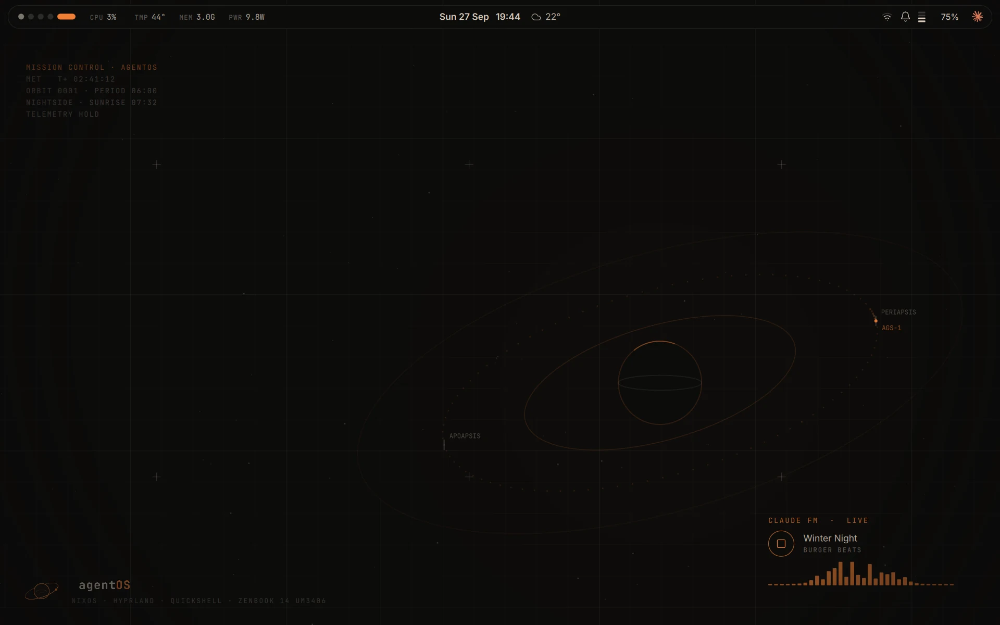
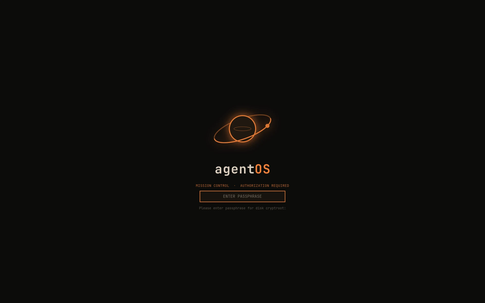
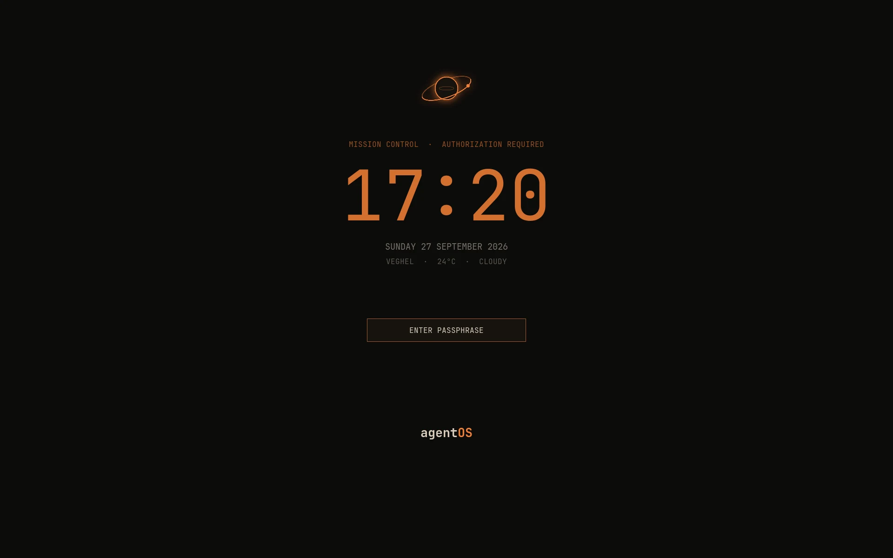
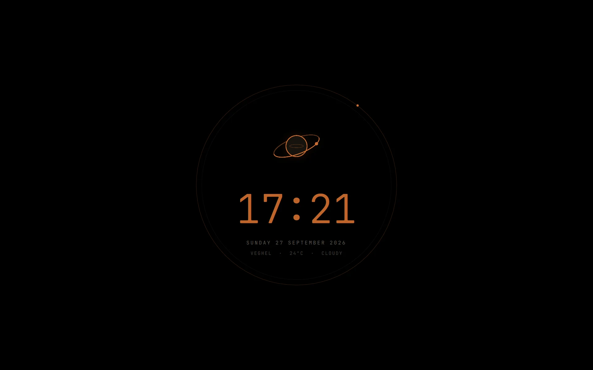
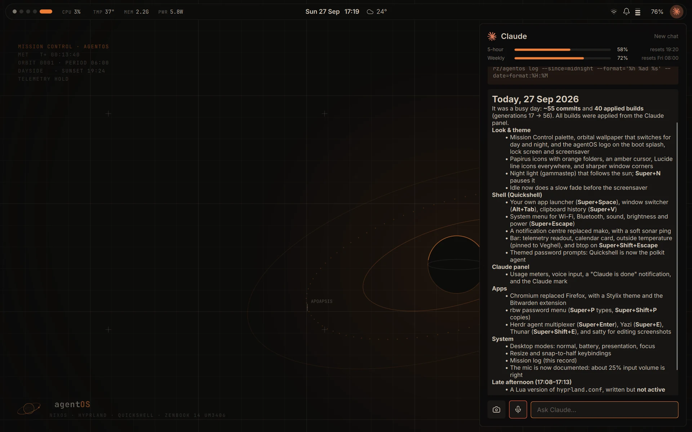
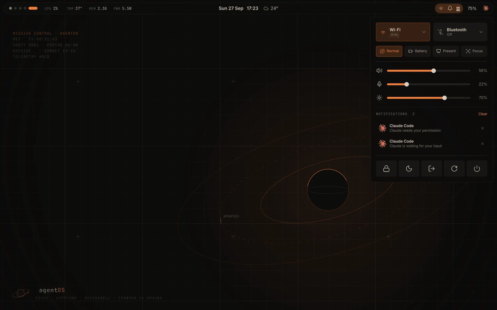
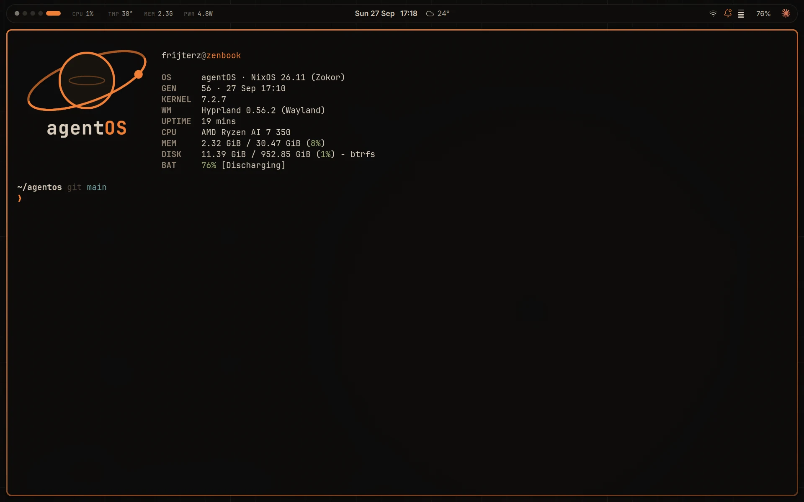

<p align="center">
  <picture>
    <source media="(prefers-color-scheme: dark)" srcset="docs/agentos-dark.png">
    
  </picture>
</p>

<p align="center">
  A Claude-first NixOS desktop for the ASUS Zenbook 14 OLED (UM3406).<br>
  Hyprland + Quickshell, a retro Mission Control look, and Claude built into the shell.
</p>



| | |
|---|---|
|  |  |
| **Boot splash** with the disk passphrase prompt (rendered from the theme's own images and layout) | **Lock screen** |
|  |  |
| **Screensaver**: true black with a dim clock ring (OLED-safe) | **Claude panel** (Super+A), here answering from the mission log |
|  |  |
| **System menu** (Super+Escape) | **A fresh terminal**: Starship prompt and fastfetch |

- **Install:** [docs/INSTALL.md](docs/INSTALL.md)
- **The Claude layer, phase by phase:** [agent/README.md](agent/README.md)
- **Rules Claude follows in this repo:** [CLAUDE.md](CLAUDE.md)

## What's in it

**Claude, built in.** Super+A opens a panel running Claude Code on this repo: it can
explain the system, edit the config, build it and commit. It can never apply a change
itself: a build shows up as a card with the package diff, and **Apply** asks for your
password (a `/home` snapshot is taken first, **Undo** rolls back). Anything outside its
allow list becomes an Approve / Deny card. Around it:
- **Weekly updates**, prepared in the background and offered as a card with a summary.
- **A health watcher** for failed services, journal errors, battery and disk space.
- **A mission log** (Super+L): a private daily record of what changed and why, with a
  short summary per day. Kept on the laptop only, never in this repo.
- **Voice input** in the panel, transcribed locally (whisper.cpp); nothing leaves the laptop.
- **Desktop modes**: normal, battery, presentation, focus (Super+M).

**The shell** (Quickshell, live-reloading QML in `config/quickshell/`):
- A floating bar: workspaces, CPU / temperature / memory / power telemetry (click for
  btop), date, time and outside temperature (click for the calendar and a three-day
  outlook), Wi-Fi, notifications and volume, battery, and the Claude button.
- App launcher with a calculator and "ask Claude" (Super+Space), system menu with Wi-Fi,
  Bluetooth, sound, brightness, modes and power (Super+Escape), notification centre,
  clipboard history with image previews (Super+V), Alt+Tab window switcher, workspace
  overview (Super+Tab), and a live cheat sheet of every key (Super+/).

**The look**: a retro sci-fi / NASA-punk "Mission Control" theme, near-black with mission
orange, calm and barely moving.
- One base16 palette (`modules/nixos/themes/mission-control.yaml`) through Stylix for GTK,
  Qt, the terminal, Chromium, fuzzel and the shell.
- An orbital-plot wallpaper that follows the real sun: a warm haze by day, faint stars
  and a thin crescent by night. It drifts a few pixels over time so nothing burns in,
  and it freezes on battery.
- The agentOS mark on the boot splash, lock screen, screensaver and wallpaper; thin
  Lucide line icons; Papirus icons with orange folders; an amber cursor; soft sonar
  pings for notifications and locking.
- Night light that follows sunset (gammastep, Super+N), and a slow fade before the
  screensaver starts.

**Apps and tools**: Ghostty with Herdr for agent sessions, Chromium with Bitwarden, rbw
passwords (Super+P), Yazi and Thunar for files, satty to annotate screenshots, btop.

**The laptop**: LUKS + Btrfs with snapper, both speakers with ASUS tuning, an 80% charge
limit and s2idle suspend. No Hyprland plugins, on purpose: they break on Hyprland updates.

## Layout

```
flake.nix                  inputs + vars (user, host, repo path)
hosts/zenbook/             host entry, disk layout (disko), hardware config
modules/nixos/             system: core, boot, splash, hardware quirks, desktop, theming,
                           snapshots, the Claude layer (agent.nix)
modules/nixos/themes/      palette, logo, sounds and line icons (built from source)
home/                      user: Hyprland, shell, idle/lock, apps, terminal, weather,
                           night light, clipboard, screenshots
config/hypr/               LIVE Hyprland config (reloads on save)
config/quickshell/         LIVE Quickshell shell (hot-reloads on save)
agent/                     the Claude layer's scripts and roadmap
docs/                      install guide, logo and screenshots
```

## Everyday use

| What | How |
|---|---|
| Change anything | Ask Claude (Super+A), or `cd ~/agentos && claude` in a terminal |
| Build and preview a change (safe) | `nh os build` |
| Apply it | **Apply** on the panel card, or `nh os switch` in a terminal |
| Undo the last switch | **Undo** on the card, `sudo nixos-rebuild switch --rollback`, or the boot menu |
| Update everything | the weekly update card, or `nix flake update && nh os switch` |
| What changed lately? | Super+L (mission log), or ask Claude |
| Restore a file from /home | `snapper -c home list`, then `snapper -c home undochange A..B <file>` |
| Clean old generations | automatic weekly (`nh clean`), keeps 15 / 14 days |

## Keys

The full list is always one key away: **Super + /** shows every binding, read live
from Hyprland. The main ones:

| Key | Action |
|---|---|
| Super + / | Cheat sheet (all keys) |
| Super + A | Claude panel |
| Super + Space | Launcher (apps, `=` calculator, else ask Claude) |
| Super + Enter / Shift | Terminal with Herdr / plain terminal (Ghostty) |
| Super + B | Chromium |
| Super + E / Shift | Files: Yazi in the terminal / Thunar |
| Super + P / Shift | Password: type / copy (rbw) |
| Super + V | Clipboard history |
| Alt + Tab | Window switcher (let go of Alt to switch) |
| Super + Tab | Workspace overview |
| Super + Escape | System menu (Wi-Fi, Bluetooth, sound, power) |
| Super + Shift + Escape | System monitor (btop) |
| Super + C | Calendar and weather |
| Super + L | Mission log |
| Super + N | Night light pause / resume |
| Super + M | Next mode (normal / battery / presentation / focus) |
| Super + 1…9 / Shift | Go to / move to workspace |
| Super + arrows / Shift / Alt | Move focus / move window / snap to a screen half |
| Super + Q · F · T | Close · fullscreen · float |
| Super + S / Super + Alt + S | Scratchpad: show / send a window there |
| Super + Shift + S | Screenshot area → clipboard |
| Super + Ctrl + S, Print | Screenshot area → editor (draw, crop) |
| Super + Shift + C | Colour picker |
| Super + Ctrl + L | Lock |
| Super + Ctrl + Shift + E | Log out |
| 3-finger swipe | Switch workspace |

Your own wallpaper instead of the orbital plot, without rebuilding:
`ln -sf ~/Pictures/x.jpg ~/.local/state/agentos/wallpaper`.
